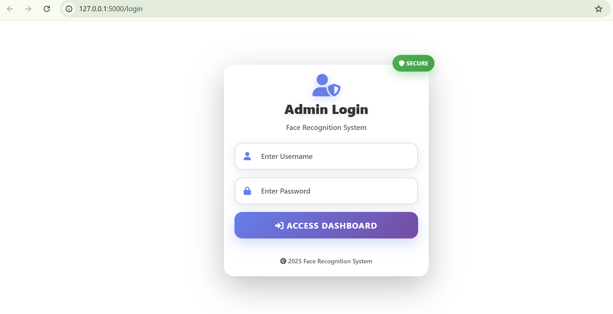
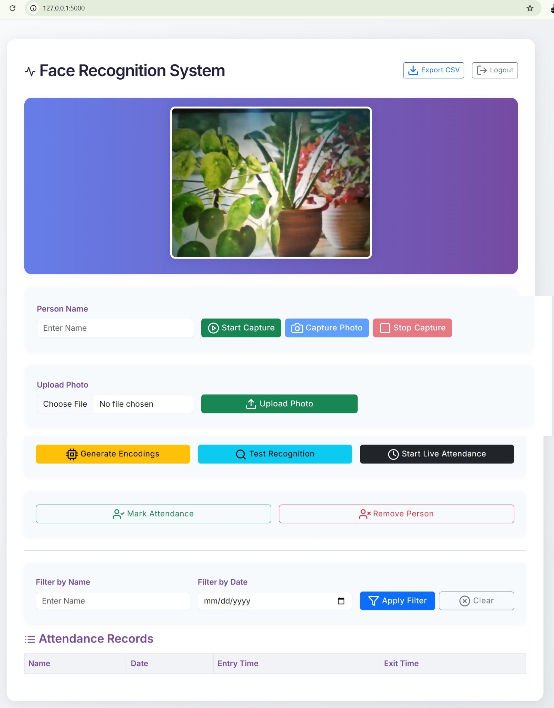

# Face Recognition Attendance System

## 📝 About the Project

A real-time **face recognition-based attendance system** built with **Flask**, **OpenCV**, and **face_recognition**. This project enables automatic attendance marking, user management, live monitoring, and reporting—all from a modern web dashboard.

This system enables **automatic, contactless attendance marking** using facial recognition. It captures live video from a camera (webcam), detects and recognizes faces, and logs attendance with timestamps. The web dashboard allows user registration, attendance monitoring, CSV export, and more.

To make this project accessible to everyone—including non-technical users—I have included clear single-line and multi-line comments throughout every file. These comments explain the purpose and functionality of the code step by step, making it easy to understand and modify.

Special thanks to Perplexity AI for assisting me in generating and refining these comments for maximum clarity.

**Key Features:**
- Real-time face detection and recognition (OpenCV, face_recognition)
- Liveness detection (anti-spoofing)
- Attendance logging (SQLite + CSV export)
- User registration with multi-photo capture and image upload
- Web dashboard (Flask, Bootstrap, Jinja2)
- Filtering attendance records by date and name
- Admin authentication

## 🖥️ **Web Interface Screenshots**

### **Admin Login Page**

*Secure admin authentication with username and password*

### **Main Dashboard**

*Complete attendance management with filtering and export options*

## 📁 Folder Structure

```
face_recognision/                         # 🔸 Main project folder
│
├── attendance_report.py                  # CLI tool to view SQLite logs
├── capture_faces.py                      # Guided face capture with audio
├── encode_faces.py                       # Generates encodings + thumbnails
├── real_time_attendance.py               # Real-time attendance + liveness
├── real_time_recognition.py              # Real-time recognition only
├── spoof_utils.py                        # Liveness detection utility
├── sync_csv_to_db.py                     # CSV → SQLite sync tool
├── test_webcam.py                        # Webcam test script
│
├── dashboard/  
|   ├── app.py                               # Flask dashboard backend
|   ├──templates/                            # 🔸 HTML files for dashboard
│      ├── index.html                        # Dashboard with filters + attendance table
│      └── login.html                        # Admin login page
│
├── database/                             # 🔸 Database folder
│   ├── attendance.db                     # SQLite DB (after creation)
│   ├── create_attendance_db.py          # Script to create the DB
│   ├── database_utils.py                # Functions for logging to DB
│   └── __init__.py                      # (likely empty or for structure)
│
├── dataset/                              # 🔸 Person-wise folders (5 images each) 
│   └── person_name/                      # e.g., /rudra/ with images
│
├── encodings/                            # 🔸 Saved face encodings
│   └── face_encodings.pkl
|
├── exports/                              # 🔸 CSV exports
│
├── models/                               # 🔸 Face/liveness detection model
│   ├── face_detection_yunet_2023mar.onnx
|   ├── modelrgb.onnx
│
├── static/                               # 🔸 Static assets
    └── thumbnails/                       # stores the best photo as per model
```

## ⬇️ Installation Steps

1. **Clone the Repository**
```bash
git clone https://github.com/RudraChouhan03/facerecognitionattendancesystem.git
cd face-attendance-flask
```

2. **Set Up a Virtual Environment**

**Note:**  

*face_recognition* is built on dlib, which does NOT yet support Python ≥ **3.11** reliably. *dlib* last stable builds work well up to Python **3.10**, newer versions are unstable or unavailable for 3.11+

```bash
"(your path)\python.exe" -m venv venv   /   conda create --name venv python=3.10.18
# Activate:
# Linux/Mac:
source venv/bin/activate  /   conda activate face_env
# Windows:
venv\Scripts\activate 
```

3. **Install Dependencies**
```bash
pip install -r requirements.txt
```

**Note:**

apart from these libraries you also need to install **Visual studio installer** from the browser and after downloading, inside it tick the desktop developement with c++ and under installation details appeared on right sidebar, under optional tick these: MSVC v143 - VS 2022 C++ x64/x86 build..., Windows 11 SDK (10.0.26100.3916), C++ CMake tools for Windows, Testing tools core features - Build Tools, C++ AddressSanitizer and , vcpkg package manager

4. **Prepare Required Directories**

Ensure these folders exist (create if missing):
- `dashboard/`
- `database/`
- `dataset/`
- `encodings/`
- `exports/`
- `models/`
- `static/thumbnails/`

5. **Once run**
```bash
python database/create_attendance_db.py"
```
To create daily_attendance table so that when we run the app.py it does not raises an error *sqlite3.OperationalError: no such table: daily_attendance*.

6. **Download & Place Models**

Put YuNet and liveness models inside the `models/` folder.

7. **Start the Application**
```bash
python dashboard/app.py
```
Visit [http://127.0.0.1:5000/](http://127.0.0.1:5000/)

## 🔑 Default Admin Credentials
> You can change these in `app.py`

```
Username: rudra
Password: rudra123
```

## 🚀 How It Works

1. **Login** → Admin logs in
2. **Register a person** → Capture or upload images
3. **Generate encodings** → Converts images to face encodings
4. **Test Recognition** → test face recognition after encoding  
5. **Start Live Attendance** → Detect and recognize people in real-time
6. **Mark Attendance** → Log entry or exit time automatically
7. **Remove Person** → remove the person photos from dataset and static/thumbnails folder
8. **Export CSV** → Download all records
9. **Attendance Table** → view the attendance stored in the database till date (can apply date and person wise filter also)

## ⚙️ Configuration

- **Change admin credentials**: `app.py → ADMIN_USERNAME / ADMIN_PASSWORD`
- **Switch to CCTV/IP Camera**: Modify `cv2.VideoCapture()` inside app.py
- **Set encoding thresholds**: Adjust distance threshold from 0.6

## 🛠️ Troubleshooting

- **Camera not found**: Check webcam or CCTV configuration
- **Face not recognized**: Regenerate encodings and check image quality
- **App crash**: Check Python version (3.7–3.10.18 recommended)

## 📚 References

- [OpenCV](https://opencv.org/)
- [face_recognition](https://github.com/ageitgey/face_recognition)
- [Flask](https://flask.palletsprojects.com/)
- [Bootstrap](https://getbootstrap.com/)

## ⚠️ Notes

- Default credentials must be changed before production
- This app is for small-scale deployment and education
- For scaling, consider GPU use or cloud deployment
- DISCLAIMER: This application is not optimized for detecting or recognizing faces in rapid motion.
- Accuracy may significantly decrease when subjects are moving quickly or the image is blurred.
- It happens becuase this project is built without the gpu. So, high accuracy model is not used.

---

**Contributions welcome!** 

Feel free to fork, raise issues, or submit PRs.

## 📞 Contact

- Developer: Rudra Chouhan
- Email: rudrachouhan0305@gmail.com
- LinkedIn: https://www.linkedin.com/in/rudrachouhan
- Mobile No.: +91 7549019916
